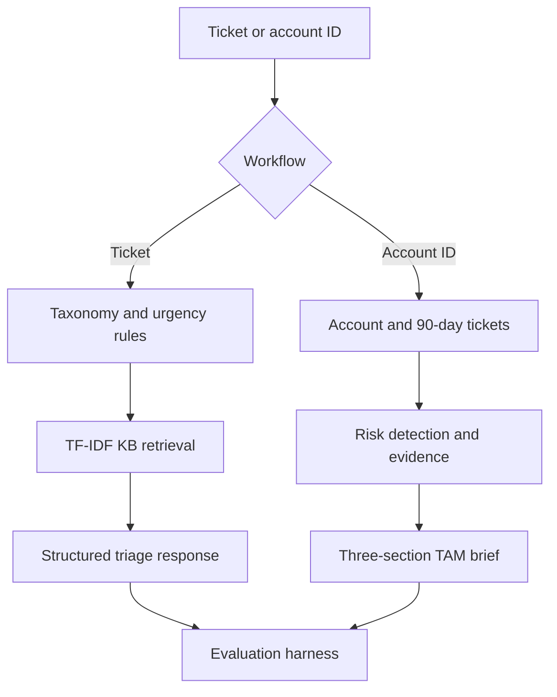

# Support Intelligence for Support and TAM Teams

Submission for the **Zycus AI Engineer - Product Support Intern** task round.

This project provides a deterministic ticket-triage agent, an account-health brief generator, an evaluation harness, REST APIs, and a Streamlit demo. It uses only the supplied synthetic dataset.

## Features

- Classifies product, product area, issue category, and P1-P4 urgency with reasoning.
- Retrieves relevant documentation from the supplied knowledge base using TF-IDF RAG.
- Routes tickets and drafts a first response.
- Builds a three-section TAM brief from account data and the last 90 days of tickets.
- Flags churn/escalation risks with a direct evidence quote and source.
- Produces deterministic results using fixed rules, stable sorting, and the maximum dataset timestamp.
- Includes 10 evaluation cases, adversarial tests, CI, prompt versioning, FastAPI, and Streamlit.

## Architecture



## Setup

Python 3.11 is recommended.

```bash
python -m venv .venv
```

Windows PowerShell:

```powershell
.venv\Scripts\Activate.ps1
pip install -r requirements.txt
```

macOS/Linux:

```bash
source .venv/bin/activate
pip install -r requirements.txt
```

No API key is required. Never commit `.env`.

## Single entry-point demo

```bash
streamlit run ui/streamlit_app.py
```

Open `http://localhost:8501`.

## REST API

```bash
uvicorn app.main:app --reload
```

Open `http://localhost:8000/docs`.

Task 1 sample:

```bash
curl -X POST http://localhost:8000/triage \
  -H "Content-Type: application/json" \
  -d '{"subject":"SecureVault SSO outage","body":"Complete outage in production. All users cannot login due to a SAML error."}'
```

Task 2 sample (use any ID from `data/accounts.json`):

```bash
curl http://localhost:8000/accounts/ACC-3336/brief
```

## Evaluation

```bash
pytest -q
python evals/run_evals.py
```

The harness defines five cases per task, reports pass/fail and a 0-1 quality score, and writes `eval_report.json`. Adversarial coverage includes an ambiguous ticket and a missing account ID. GitHub Actions runs both checks on every push and pull request.

## Design note (~600 words)

### Failure modes

**1. Incorrect urgency or routing.** Customer language can be vague, exaggerated, or omit affected-user counts. A word such as “urgent” may cause over-prioritisation, while a short outage report may be under-prioritised. I separate impact signals from sentiment: outage, all-user, data-loss, security, production, and workaround signals control urgency. Reasoning remains visible for agent review. In production, I would monitor agent overrides, confusion matrices, and P1 false-negative rates. High-impact or low-confidence cases would require human approval.

**2. Wrong knowledge retrieval.** TF-IDF can miss synonyms or retrieve a document sharing terms without containing the solution. I use a minimum similarity threshold and return no match below it. Document path, title, score, and excerpt are visible for verification. Production monitoring would measure click-through, resolution usefulness, and recall on a reviewed golden set. Hybrid lexical-plus-embedding retrieval and reranking would be the next improvement.

**3. Misleading account risks.** Account fields can be stale, joins can be missing, and strong phrases may appear outside a risk context. The implementation handles missing IDs explicitly, uses only a fixed 90-day window, and attaches a direct source quote to every flag. TAM feedback, unsupported-claim audits, and brief-to-brief changes would detect failures. A production brief would show data freshness and allow false flags to be dismissed.

### Latency versus quality

I chose deterministic rules and one TF-IDF retrieval call instead of several generative calls. This gives fast local inference, reproducibility, clean installation, and no network dependency. The trade-off is less semantic flexibility and less natural prose. With more quality budget, I would retrieve multiple chunks, rerank them, and call an LLM once with a strict JSON schema, temperature zero, source IDs, and a deterministic fallback. If latency were the hard constraint, I would precompute the matrix, cache account briefs by data version, retain local rules, and run retrieval and classification concurrently.

### Data sensitivity

The baseline sends no tickets or accounts to an external API. It runs locally over supplied synthetic files. `.env` is excluded from Git, `.env.example` contains no key, and outputs expose no credentials. Production access would use least privilege, encryption, retention limits, audit logs, and tenant isolation. Before any approved external model call, a PII layer would redact names, emails, tokens, secret-bearing URLs, and account identifiers. Provider agreements would require no training or retention, while logs would contain redacted metadata instead of raw bodies.

### Scaling

At 10x volume, JSON scans and repeated account filtering fail first, not TF-IDF. I would move records to PostgreSQL, index `(account_id, created_at)`, use a queue for asynchronous briefs, and cache by account plus source-data version. The KB matrix can remain in memory at this size; later it can move to a versioned search service. Stateless FastAPI workers scale horizontally. Metrics would cover p50/p95 latency, queue depth, retrieval quality, error rate, and priority drift.

## Assumptions

- “Last 90 days” is relative to the newest ticket in the static dataset, making results reproducible.
- Historical labels may be noisy and are not blindly copied during live triage.
- Missing account IDs return 404 rather than a fabricated brief.

See `SUBMISSION_CHECKLIST.md` and `LOOM_SCRIPT.md` before submitting.

